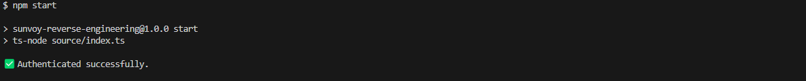
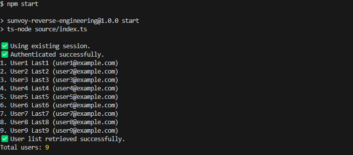
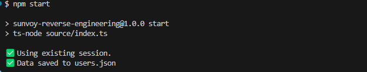

# 🏆Full Stack Engineer Challenge

## 💡Executive Summary

This repository contains the solution to the Full Stack Engineer challenge. The task involves reverse engineering a legacy web application without a public API and programmatically retrieving user data and the currently authenticated user details.

You can view the legacy application at [challenge.sunvoy.com](http://challenge.sunvoy.com). The login credentials for the application are:

- **Username:** demo@example.org
- **Password:** test

## 🪜Steps Overview

The project follows these main steps:

1. **GitHub Repository:** Created a public repository to store all scripts and progress.
2. **Users API:** Developed a script that calls the internal API to retrieve user data and stores it in a `users.json` file.
3. **Authenticated User API:** Extended the script to call the API for the currently authenticated user's details and append that information to the `users.json` file.
4. **Authentication Reuse:** Ensured that the script reuses valid authentication credentials for subsequent runs.
5. **Video Recording:** Created a short Loom video demonstrating the functionality of the script in action.

## 📦Requirements

- Node.js (Current LTS version)
- Dependencies: Fetch API for making HTTP requests.
- The script will be executed using `npm run start`.
- A `users.json` file with 10 users is generated.

## ⚙️Setup

### Prerequisites

Ensure you have the latest LTS version of Node.js installed. You can verify this by running the following command:

```bash
node -v
```

### Installation

#### 1. Clone the repository:

```bash
git clone https://github.com/your-username/full-stack-engineer-challenge.git
cd full-stack-engineer-challenge
```

#### 2. Install the required dependencies:

```bash
npm install
```

### Running the Script

#### To run the script and fetch the user data, simply execute:

```bash
npm run start
```

#### This will make the necessary API calls, retrieve the users' data, and save it into a users.json file.

### Sample Output

```bash
[
    {
        "id": 1,
        "name": "John Doe",
        "email": "john.doe@example.com"
    },
    ...
]

```

The script also appends the currently authenticated user's information into the same file.

### Authentication Reuse

#### The script automatically handles authentication reuse, so once logged in, it will use the same credentials for future requests, as long as they remain valid.

## 🎥Loom Video

A short video demonstrating the script in action can be viewed here:

<a>[Loom Video Link](https://www.loom.com/share/56dfd4ab4fd843a08d540930853887db?sid=f5b85dc8-6173-4dcc-a2c4-f008001ed57b)</a>

## 🎯Success Criteria

-The script can be executed without errors.

-A users.json file is generated with at least 10 user entries.

-The script uses fetch for API calls.

-The script reuses authentication credentials on subsequent runs.

## ⏰Time Spent

#### Total time to complete the assignment: [7] hours

## 🖼️ Screenshots

| First Step(Initialize)                      |
| ------------------------------------------- |
|  |

| Second Step(Authentication)                |
| ------------------------------------------ |
|  |

| Final Step(Complete)                        |
| ------------------------------------------- |
|  |
